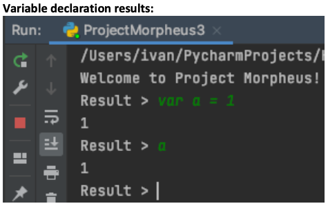
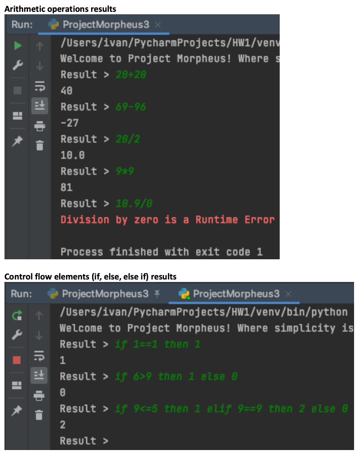
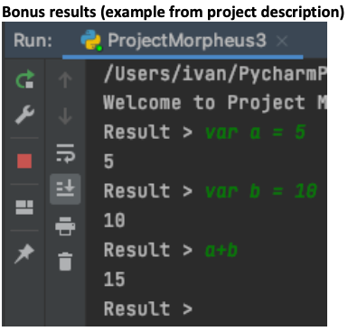

# interpreterProject
Created my own programming language that consists of three parts a lexer, a parser, and an evaluator. The program language accepts variables declarations, if statements, arithmetic operations and Integers/Float as data types.

